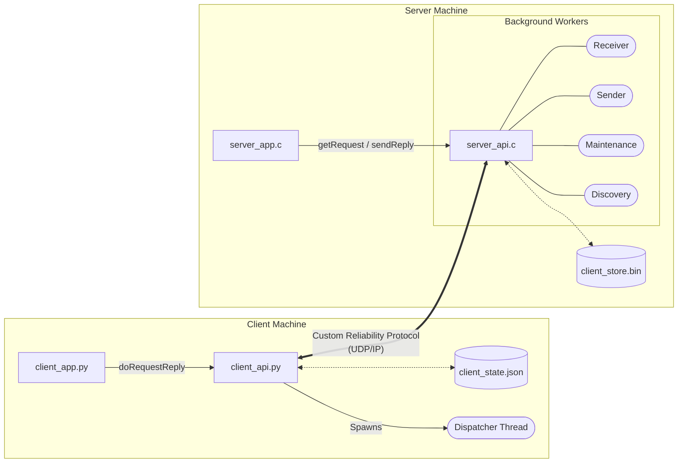

# Reliable UDP Request-Reply Framework


A high-performance, fault-tolerant networking library consisting of a **C-based multi-threaded server** and a **Python-based client library**. This project implements a custom reliability layer over UDP to handle the "unreliable" nature of the protocol through handshakes, heartbeats, and persistent state recovery.


## Features

### 1. Custom Reliability Protocol

Since UDP does not guarantee delivery, this framework implements a **Four-Way Handshake**:

1.  **Request**: Client sends data with a unique Request ID (RID).

2.  **ACK (Ping)**: Server acknowledges receipt and assigns/confirms a Client ID.

3.  **Reply**: Server sends the computed result.

4.  **Final ACK**: Client confirms receipt of the result so the server can clear its cache.

### 2. Fault Tolerance & Crash Recovery

* **Persistent Client Store**: The server saves client states to a binary file. If the server reboots, it reloads the store and notifies "Processing" clients to reset.

* **Client State Persistence**: The Python library maintains a `client_state.json`. If the client crashes mid-request, it recovers upon restart and sends a `CANCEL_SVC` to the server to clean up "zombie" tasks.

* **Heartbeat Monitoring**: During long-running tasks (like prime number calculations), the server pings the client to ensure it is still "alive."

### 3. Advanced Networking

* **Service Discovery**: Supports **UDP Broadcast** (255.255.255.255) to automatically find servers on a local network.

* **Static Configuration**: Supports fixed IP/Port configuration for environments where broadcasting is blocked (e.g., University WiFi).

* **Load Balancing**: The client queries all known servers for their load and routes work to the optimal one. Each server reports two counters: **pending** (requests queued, not yet picked up by a worker) and **active** (requests currently being processed). The client selects the server with the lowest pending count, using active count as a tiebreaker.

---

## System Architecture

### Server (C)

The server is decoupled into four specialized background threads
| Thread | Role |
|---|---|
| **Receiver** | Listens for all incoming packets; manages the Client Store and routes requests to per-service queues. |
| **Sender** | Waits on the reply queue and delivers results back to clients. |
| **Maintenance** | Runs every 2 seconds to send heartbeats to `PROCESSING` clients and retransmit replies to `WAITING_ACK` clients. Marks clients `EXPIRED` after `MAX_RETRIES` timeouts. |
| **Discovery** | Listens on port `9999` and responds to broadcast pings so clients can auto-discover the server. |

### Client (Python)

The client library (`client_api.py`) is a functional, stateless-from-the-caller's-perspective library built around a global `_State` object. It spawns one background thread:

* **Dispatcher Thread**: Continuously reads from the UDP socket. If a request is active (`_s.active` is set), packets are placed on an internal queue for the calling thread to process. If idle, the dispatcher automatically ACKs any stale reply retransmissions from the server.




---


## Packet Format

All packets share a fixed 16-byte header in **network byte order** (big-endian):

```
 0       4       8       12      16
 +-------+-------+-------+-------+
 | svcid |  cid  | reqid |  len  |
 +-------+-------+-------+-------+
```


| Field | Size | Description |
|---|---|---|
| `svcid` | 4 bytes (int32) | Service ID. Positive values are user-defined services; negative values are internal control messages (see below). |
| `cid` | 4 bytes (uint32) | Client ID assigned by the server. `0` for new/unknown clients. |
| `reqid` | 4 bytes (uint32) | Monotonically increasing request sequence number. |
| `len` | 4 bytes (int32) | Payload size in bytes. `0` for control packets. |

### Control Service IDs

| Constant | Value | Direction | Description |
|---|---|---|---|
| `PING_SVC` | `-1` | Both | Server → Client: heartbeat during `PROCESSING`. Client → Server: pong response. Also used as the handshake ACK (step 2). |
| `ERROR_SVC` | `-2` | Server → Client | Signals an error (invalid service, full table, stale request, etc.). |
| `REPLY_ACK_SVC` | `-3` | Both | Server → Client: carries the final result. Client → Server: final ACK to confirm receipt. |
| `CANCEL_SVC` | `-4` | Client → Server | Cancels an in-flight request (used on crash recovery). |
| `LOAD_BALANCE_SVC` | `-5` | Both | Client → Server: asks for load info (service ID in `reqid`). Server → Client: replies with `active_count` in the `cid` field and `pending_count` in the `reqid` field (`len` = 0). |
| `DISCOVERY_SVC` | `-6` | Both | Client broadcasts on port 9999; server echoes back so the client can discover its address. |

---

## Server API (C)

Defined in `server_api.h`. A server application calls these functions to register services and process requests.

```c
void init(char *config_file, int fixed_port);
```
Initializes the UDP socket, loads (or creates) the persistent client store, notifies any clients whose requests were in `PROCESSING` state at the time of the last crash, and starts the four background threads. Must be called once before any other function.

---

```c
int registerService(int svcid);
```
Marks service `svcid` (0 to `MAX_SERVICES - 1`) as active so the server will accept and queue incoming requests for it. Returns `0` on success, `-1` if the ID is out of range or already registered.

---

```c
int unregisterService(int svcid);
```
Deactivates a service and drains its pending queue, sending `ERROR_SVC` back to any waiting clients. Returns `0` on success, `-1` on error.

---

```c
int getRequest(int svcid, void *buf, int *len);
```
**Blocking call.** Waits until a request arrives for `svcid`, copies the payload into `buf`, and sets `*len` to the payload size in bytes. Returns a non-negative **request handle** on success, or `-1` on error. The handle must be passed to `sendReply` after processing. Calling this function increments the internal `active_count` for `svcid` (used by load balancing).

---

```c
void sendReply(int reqid, void *buf, int len);
```
Queues a reply for delivery. `reqid` is the handle returned by `getRequest`. `buf` points to `len` bytes of result data. The sender thread picks it up and transmits it to the client. Decrements `active_count` for the associated service.

### Example Usage (server_app.c)

```c
init(config_file, port);
registerService(0);           // enable service 0

// Worker loop
int buf[256]; int byte_len;
int handle = getRequest(0, buf, &byte_len);  // blocks until request arrives
// ... compute result ...
sendReply(handle, result, result_len);
```

---

## Client API (Python)

Defined in `client_api.py`. A client application calls these two functions.

```python
init(config_file=None, state_file="client_state.json")
```
Initializes the client. Opens the UDP socket, discovers servers (via broadcast if `config_file` is `None`, otherwise reads `IP PORT` entries from the file), performs crash recovery (cancels any pending request found in `state_file`), and starts the dispatcher thread. Raises `ValueError` if no servers are found.

---

```python
result = doRequestReply(svc_id, payload)
```
**Blocking call.** Sends `payload` (bytes) to the best available server for `svc_id` and returns the result once the full four-way handshake completes.

* Internally runs the load-balancing query, the handshake phase, and the result-waiting phase.
* Handles heartbeat pongs transparently.
* Retries up to `MAX_ATTEMPTS` (3) times with a `TIMEOUT` (3 s) per attempt.
* Persists the pending request to `state_file` before sending so a crash can be recovered.
* Returns a `list[bool]` on success, or an error string (`"Error: ..."`) on failure.

### Example Usage (client_app.py)

```python
import client_api, struct

client_api.init(config_file="config.txt", state_file="client_state.json")

payload = struct.pack("!4I", 7, 13, 25, 101)   # four numbers to test
result  = client_api.doRequestReply(0, payload)  # [True, True, False, True]
```

---

## Build & Run

### Server

```bash
make
./server <port> <store_file> <num_workers>
```

| Argument | Description |
|---|---|
| `port` | UDP port to listen on (e.g. `10001`) |
| `store_file` | Path for the persistent client store (e.g. `client_store.bin`) |
| `num_workers` | Number of worker threads to spawn |

**Example:**
```bash
./server 10001 client_store.bin 4
```

### Client

```bash
python client_app.py --requests <file> [--config <file>] [--state <file>]
```

| Flag | Description |
|---|---|
| `--requests`, `-r` | Path to the requests file (required) |
| `--config`, `-c` | Path to the server config file. If omitted, uses UDP broadcast discovery. |
| `--state`, `-s` | Path to the persistent state file (default: `client_state.json`) |

**Example (with discovery):**
```bash
python client_app.py -r requests.txt
```

**Example (static config):**
```bash
python client_app.py -r requests.txt -c config.txt
```

---

## Configuration Files

### `config.txt` — Static Server List

One server per line in `IP PORT` format:

```
10.64.16.39 10001
10.64.16.36 10001
```

### `requests.txt` — Workload File

One request per line in `svc_id: val1, val2, ...` format. Values are packed as 32-bit unsigned integers and sent as the request payload.

```
0: 7, 13, 25, 101
0: 999999001, 999999017, 999999015
0: 2, 3, 5, 8, 13, 21
```

Service `0` is the primality testing service. The server returns a boolean array indicating which numbers are prime.
